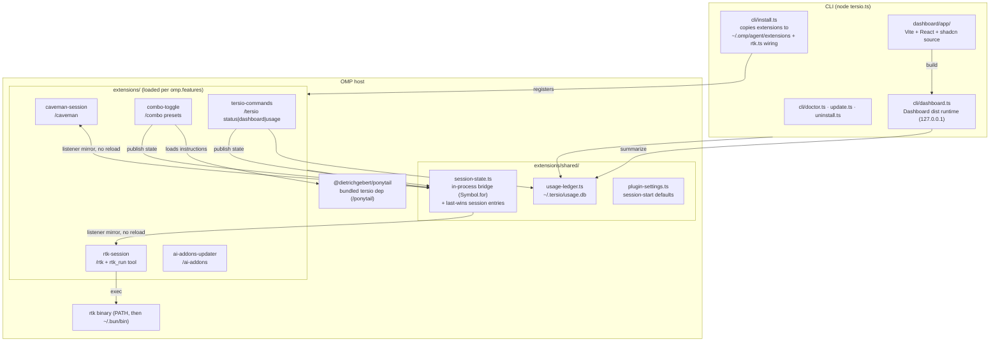
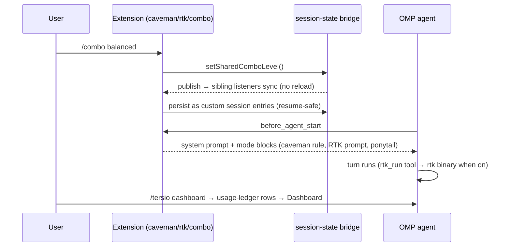

# Architecture

Tersio is one npm package with two faces: a **CLI** (`tersio install|update|doctor|dashboard…`) and an **OMP plugin** whose feature-gated extensions load inside the OMP host.

## Components

## One turn, runtime flow

## Key invariants

- **Bridge, not reload:** `session-state.ts` uses a `Symbol.for` global bridge; a toggle publishes and siblings mirror live. Custom session entries are the persistence layer — `reconcileSharedComboEntries` rebuilds state on resume/branch.
- **Subagents inherit:** `isOmpSubagentPrompt` makes subagent turns read shared state instead of local flags.
- **Prompt persistence:** Caveman, RTK, and Ponytail extensions inject active modes each turn. The former separate reinforcement extension is retired because it duplicated the same directives.
- **Ledger is best-effort:** append-only JSONL; `tersio reset` writes a watermark instead of deleting host-owned files.
- **Always on:** `omp.extensions` in `package.json` loads every mode extension. Only `updater` stays an optional feature.
- **Single owner:** OMP plugin manifests load Tersio extensions and nested Ponytail. `config.yml` holds only rtk-owned wiring; doctor removes retired, duplicate, or legacy manifest-owned entries.
- **Caveman rule ownership:** `extensions/caveman-session/rule.md` ships beside the manifest-loaded extension. Doctor and updater inspect that installed plugin path, not the retired agent copy.
