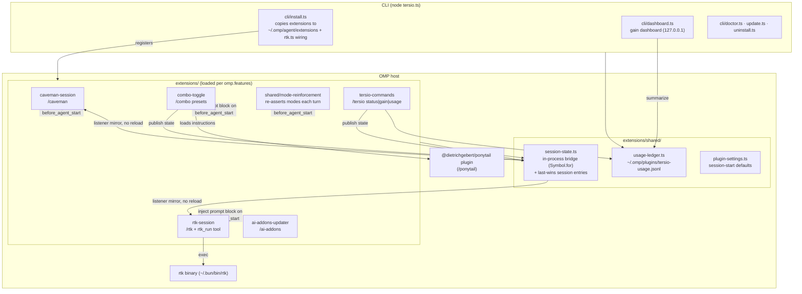
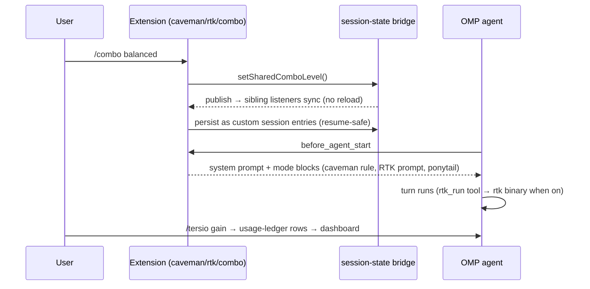

# Architecture

Tersio is one npm package with two faces: a **CLI** (`tersio install|update|doctor|gain…`) and an **OMP plugin** whose feature-gated extensions load inside the OMP host.

## Components

## One turn, runtime flow

## Key invariants

- **Bridge, not reload:** `session-state.ts` uses a `Symbol.for` global bridge; a toggle publishes and siblings mirror live. Custom session entries are the persistence layer — `reconcileSharedComboEntries` rebuilds state on resume/branch.
- **Subagents inherit:** `isOmpSubagentPrompt` makes subagent turns read shared state instead of local flags.
- **Reinforcement:** `mode-reinforcement.ts` re-appends the mode block after Ponytail's prompt and after compaction; last-wins entry scan ignores corrupt writes.
- **Ledger is best-effort:** append-only JSONL; `tersio reset` writes a watermark instead of deleting host-owned files.
- **Features are optional:** `omp.features` in `package.json` gates each extension file, so `tersio[caveman,ponytail]` subsets load only those.
