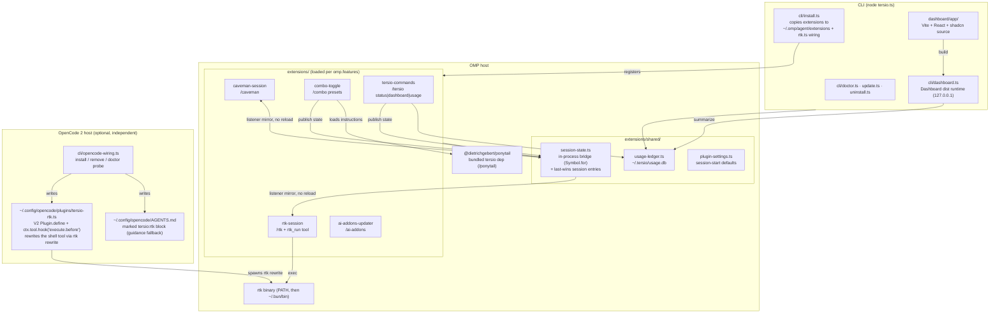
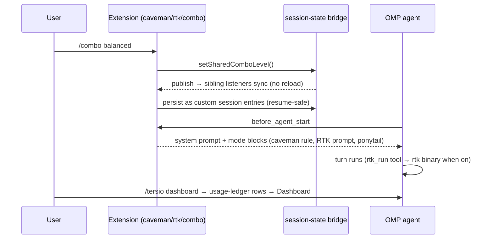

# Architecture

Tersio is one npm package with two faces: a **CLI** (`tersio install|update|doctor|dashboard…`) and an **OMP plugin** whose feature-gated extensions load inside the OMP host.

## Components

## One turn, runtime flow

## Key invariants

- **Bridge, not reload:** `session-state.ts` uses a `Symbol.for` global bridge; a toggle publishes and siblings mirror live. Custom session entries are the persistence layer — `reconcileSharedComboEntries` rebuilds state on resume/branch.
- **Subagents inherit:** `isOmpSubagentPrompt` makes subagent turns read shared state instead of local flags.
- **Prompt persistence:** Caveman, RTK, and Ponytail extensions inject active modes each turn. The former separate reinforcement extension is retired because it duplicated the same directives.
- **Ledger is best-effort:** append-only JSONL; `tersio reset` writes a watermark instead of deleting host-owned files.
- **Always on:** `omp.extensions` in `package.json` loads every mode extension. Only `updater` stays an optional feature.
- **Single owner:** OMP plugin manifests load Tersio extensions and nested Ponytail. `config.yml` holds only rtk-owned wiring; doctor removes retired, duplicate, or legacy manifest-owned entries.
- **Caveman rule ownership:** `extensions/caveman-session/rule.md` ships beside the manifest-loaded extension. Doctor and updater inspect that installed plugin path, not the retired agent copy.
- **OpenCode is a second host, not a peer:** OpenCode 2 gets only the RTK shell rewrite plus AGENTS.md guidance. Combo state, the session bridge, and the status bar stay OMP-only because OpenCode has no equivalent of the in-process bridge.
- **Tersio owns the OpenCode plugin:** `rtk init --opencode` emits a V1 plugin that OpenCode 2 rejects, so `cli/opencode-wiring.ts` writes the V2 file instead. Rewrite rules stay in the rtk binary, so an rtk upgrade needs no plugin edit.
- **Optional host, warning only:** doctor reports a missing OpenCode plugin or guidance block as a warning, never a failure, because most machines never run OpenCode.
- **Host selection is separate state:** the chosen hosts live in `~/.tersio/agents.json`, not the OMP plugin lock file, because a non-OMP user has no OMP plugin to hang settings off. OMP is always included by detection; every other host auto-detects only when its own config directory already exists, so a host nobody installed never gets a directory created for it. Each host's directory honors its own relocation variable.
- **One registry, one source of truth:** `cli/agent-hosts.ts` holds every host's docs-backed paths and capabilities; `cli/rules-pack.ts` holds the mode text. `cli/host-writers.ts` renders a host's files from those two and nothing else, so adding a host means adding a registry entry, not a new code path. `omp` and `opencode` are in the registry for selection and detection but are installed by their own wiring modules — the generic emitters would duplicate a live extension with a static file.
- **The rewriter is generated, not shared:** five different hook wire protocols are in play (`hookSpecificOutput.updatedInput`, `hookSpecificOutput.tool_input`, `modifiedArgs`, `updated_input`, and Hermes' `action: modify`). Rewrite rules stay in the rtk binary; the generated script only marshals stdin to `rtk rewrite` and stdout back into the host's shape, and always exits 0 so a failure degrades to no rewriting rather than a blocked command.
