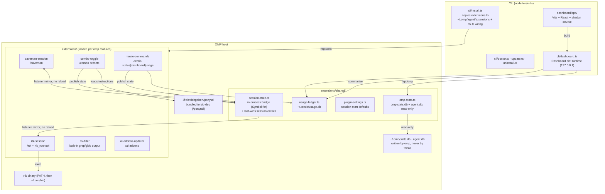
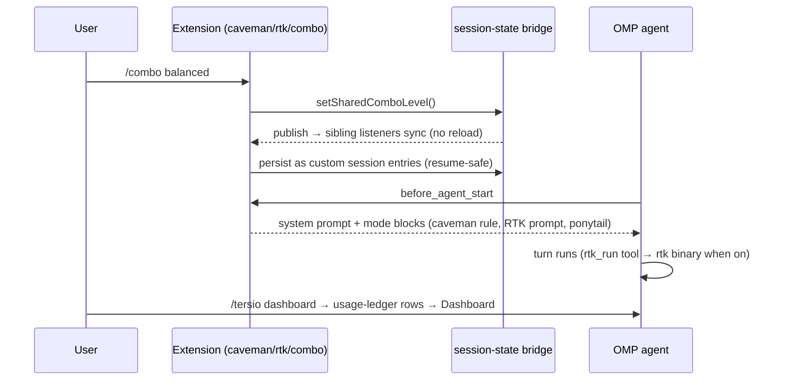
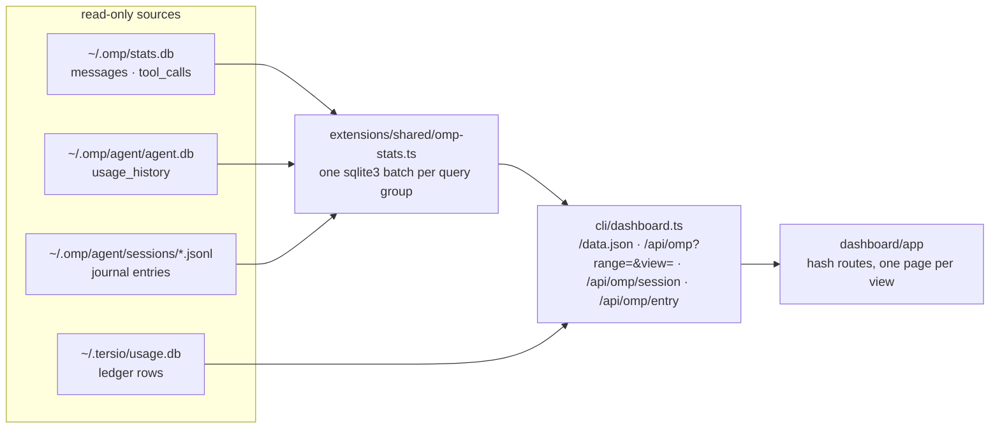

# Architecture

Tersio is one npm package with two faces: a **CLI** (`tersio install|update|doctor|dashboard…`) and an **OMP plugin** whose feature-gated extensions load inside the OMP host.

## Components

## One turn, runtime flow

## omp-stats dashboard

The dashboard replicates every page of `@oh-my-pi/omp-stats`, one hash route each, so one server, one payload contract, and one visual language cover both sources. Tersio metrics read `~/.tersio/usage.db`; omp metrics read omp's own databases, read-only, and both sit behind the same rail.

- **One page per view.** The URL hash is the router: `#/models?range=7d`, with `&s=<sessionFile>` deep-linking a transcript. The routes match the upstream dashboard, so a link from either tool works in the other. Setters push a history entry, so back and forward behave.
- **The aggregate mirrors the reference, metric for metric.** `readOmpStats(range, view)` reimplements the same SQL facts: `failed` counts only `stop_reason = 'error'`, `cacheRate` is `cacheRead / (input + cacheRead)`, `cacheSavings` is `(noCacheCost - cachedCost) / noCacheCost` over rows that carry a `cost_no_cache_input`, and `avgTokensPerSecond` divides by `COUNT(duration > 0)`. The subscription-window engine ports the same rules too: a window is one `(provider, limitId)` pair, consumption sums only positive fraction deltas, a drop past 0.05 counts a cycle, and the peak is the swept sum across accounts. Each rule is pinned by `test/usage/omp-stats.test.ts` and was checked against the live `/api/stats` at a matched row count.
- **A view asks for only what it renders.** `view=<page>` selects the query groups the server runs and the fields it returns, so a page payload stays in the tens of kilobytes instead of one snapshot. Reads are memoized for five seconds per range and view, and re-read when `stats.db` or `agent.db` moves.
- **Never a write.** Every read opens with `sqlite3 -readonly`. The two WAL traps are handled in order: `-readonly` first, then `immutable=1` only when no `-wal` file exists (it would silently ignore the log), then a copy of `db` + `-wal` + `-shm` into a temp directory. Nothing opens read-write, which would create side files in omp's directory.
- **Range is URL state.** Keys `1`-`6` pick a window and `g` then a letter opens a page. An exported file carries a single window, so its picker is a label, not a control.
- **Two marks, two jobs.** `VendorMark` names the model author, resolved from the model id. `ProviderMark` names the routing service. A neutral gateway keeps a monogram rather than borrowing a vendor's logo, and no mark ever fetches over the network: `scripts/fetch-marks.ts` vendors each asset and `dashboard/app/test/marks.test.tsx` fails if a source file names a logo host.
- **Degrade by source.** A missing `stats.db` hides the omp-only pages and leaves Overview, Requests, Tools, and Tersio's own Usage page. A missing `usage_history` hides only the quota half of Providers.

## Key invariants

- **Bridge, not reload:** `session-state.ts` uses a `Symbol.for` global bridge; a toggle publishes and siblings mirror live. Custom session entries are the persistence layer — `reconcileSharedComboEntries` rebuilds state on resume/branch.
- **Subagents inherit:** `isOmpSubagentPrompt` makes subagent turns read shared state instead of local flags.
- **Subagent detection is text-based:** `OMP_SUBAGENT_MARKER` is a verbatim sentence from the host's subagent prompt, so a reworded host drops it silently. `tersio doctor` scans the omp binary for it and warns; `tersio settings markers` overrides it. pi has no built-in subagent prompt, so only omp is detectable by text.
- **Injection appends only:** a mode switch leaves the previous level's text in an accumulating prompt. Removing it needs host support to rewrite the system prompt, which an extension cannot reach.
- **Bridge state is process-global:** the `Symbol.for` bridge and `RTK_DISABLED` are unscoped, so one process serving two sessions would share them. Correct for the single-user hosts this targets.
- **Prompt persistence:** Caveman, RTK, and Ponytail extensions inject active modes each turn. The former separate reinforcement extension is retired because it duplicated the same directives.
- **Ledger is best-effort:** append-only JSONL; `tersio reset` writes a watermark instead of deleting host-owned files.
- **The mirror never discards a store from a newer tersio:** a `parser_version` above this build keeps its rows and skips the re-parse, because rotated transcripts cannot rebuild them. `TERSIO_FORCE_REPARSE=1` accepts the loss.
- **Always on:** `omp.extensions` in `package.json` loads every mode extension. Only `updater` stays an optional feature.
- **Single owner:** OMP plugin manifests load Tersio extensions and nested Ponytail. `config.yml` holds only rtk-owned wiring; doctor removes retired, duplicate, or legacy manifest-owned entries.
- **Caveman rule ownership:** `extensions/caveman-session/rule.md` ships beside the manifest-loaded extension. Doctor and updater inspect that installed plugin path, not the retired agent copy.
